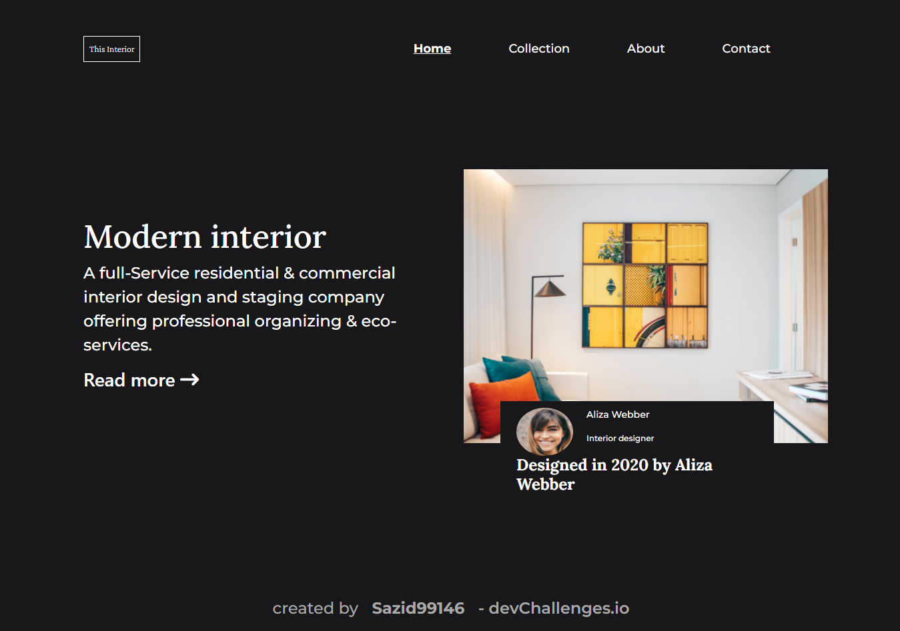

<!-- Please update value in the {}  -->

<h1 align="center">Interior Consultant</h1>

   Solution for a challenge from  <a href="http://devchallenges.io" target="_blank">Devchallenges.io</a>.

  <h3>
    <a href="https://sazid99246.github.io/interior-consultant/">
      Demo
    </a>
     | 
    <a href="https://github.com/Sazid99246/interior-consultant">
      Solution
    </a>
     | 
    <a href="https://devchallenges.io/challenges/Jymh2b2FyebRTUljkNcb">
      Challenge
    </a>
  </h3>

<!-- TABLE OF CONTENTS -->

## Table of Contents

- [Overview](#overview)
  - [Built With](#built-with)
- [Features](#features)
- [Contact](#contact)
- [Acknowledgements](#acknowledgements)

<!-- OVERVIEW -->

## Overview

Introduce your projects by taking a screenshot or a gif. Try to tell visitors a story about your project by answering:

- Where can I see your demo?
You can see it here https://sazid99246.github.io/interior-consultant/

- What was your experience?
My experience is awesome. I have tried hard and soul to complete the project.

- What have you learned/improved?
I have improved my skills on css positioning, bootstrap navbar etc

- Your wisdom? :)
I wish I could make it responsive.

### Built With

<!-- This section should list any major frameworks that you built your project using. Here are a few examples.-->

- [Bootstrap](https://getbootstrap.com/)

## Features

<!-- List the features of your application or follow the template. Don't share the figma file here :) -->

This application/site was created as a submission to a [DevChallenges](https://devchallenges.io/challenges) challenge. The [challenge](https://devchallenges.io/challenges/Jymh2b2FyebRTUljkNcb) was to build an application to complete the given user stories.

## Acknowledgements

<!-- This section should list any articles or add-ons/plugins that helps you to complete the project. This is optional but it will help you in the future. For exmpale -->

- [Bootstrap Navbar](https://getbootstrap.com/docs/5.1/components/navbar/)

## Contact
- GitHub [@your-username](https://github.com/Sazid99246)
